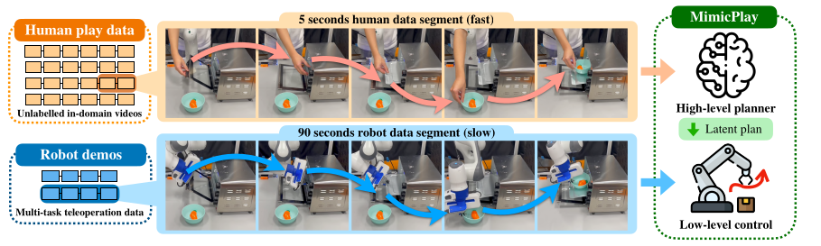
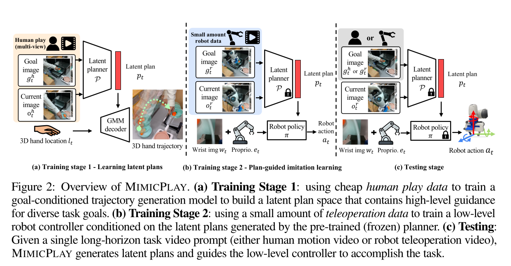
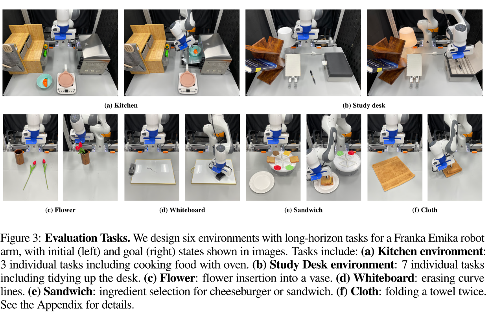
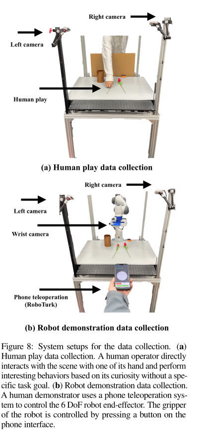
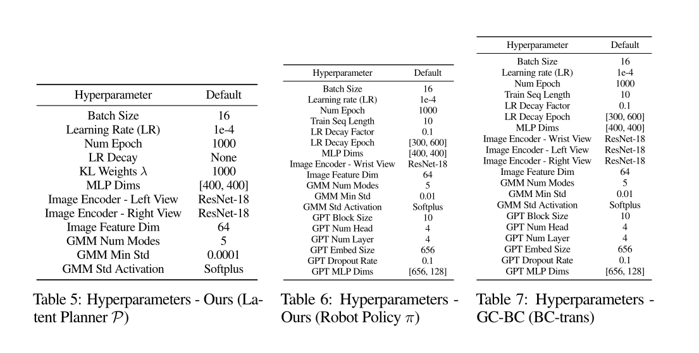

# Mimic Play: Long-Horizon Imitation Learning by Watching Human Play

## Abstract

- Hypothesis: Human demonstrations can be used for training robot policy learning even though morphologies(human hand vs robot hand) are different

Introduced hierarchial learning framework: `MimicPlay`
    - Learns latent plans from human play data to guide low-level visuomotor control
    - small number of teleoperated demonstrations
    - evaluted 14 long horizon manipulation tasks
    - Outperforms SOTA in tassk `sucess rate`, `generalization ability`, and `robustness to distrubances`

Code and videos: [mimic-play.github.io.](https://mimic-play.github.io/)

## Intuition



- High-level planner from human play data  (cheap human play data)
- Low-level control from robot demos (smallmulti-task teleoperated robot demos)


# Introduction

Two connectedd directions to scale up imitation learning:
- hierarchial imitation learning [decouple E2E training into high level planner and low level viso ]
- learning from play data
    - Play data is typically collected through human-teleoperated
robots interacting with their environment without specific task goals or guidance.
    ```Why? 
        Prior works show that
        data collected this way covers more diverse behaviors and situations compared to typical task-oriented
        demonstrations.```

## Hypothesis
```
In this work, we argue that the data required for learning high-level plan and low-level control can come
in different forms, and doing so could substantially reduce the cost of imitation learning for complex
long-horizon tasks.
```

MIMICPLAY trains a goal-conditioned latent planner from human
play data to predict the future 3D human hand trajectories conditioned on the goal images

Conditioned on these latent plans, the low-level controller incorporates state information essential for fined-grained
manipulation to generate the final actions.


-- I need clarification here: videos as prompt?! 
Moreover, MIMIC-PLAY integrates human motion and robotic skills into a ```joint latent plan space```, which enables an interface that allows using human videos directly as ```“prompts”``` for specifying goals in robot manipulation tasks.


# Related Work

## Imitation learning from demonstrations :

Traditional algorithms like DMP and PrMP exist, but open loop control.
Recent IL methods rely on DNN to have reactive policies(aka closed loop control) from raw demos.
    - Drawback: Not sample effient — needs many on-robot demos


## Hierarchical imitation learning:
All previous methods focus on learning both planning and control with a single type of data—teleoperated robot demonstrations, which is expensive to collect.

Our approach uses cheap human play data for learning high-level planning and a small number of robot
demonstrations for learning low-level control

## Learning from human videos

Due to diversity in the data source and large domain gaps, transferring the pre-trained representation to a specific manipulation task might be difficult.
Notably, Hansen et al. [43] found simple data augmentation techniques could have similar effects as these
pre-trained representations.

To reduce the domain gap:
    - utilize in-domain human videos, where human directly interacts with the robot task environment with their own hands
    - Such type of data has a smaller gap between human and robot domains, which allows sample-efficient reward shaping for training RL agents [35, 45–47] and imitation learning [29, 44, 34]

    Drawback:
    However, these works focus on learning either task rewards or features from human videos, which doesn’t
    directly help the low-level robot action generation.

    Solution:
    Only extract trajectory-level task plan.
    In this work, we extract meaningful trajectory-level task plans from human play data, which provides high-level guidance for the low-level controller for solving challenging long-horizon manipulation tasks.


## Learning from play data

A form of teleoperated robot demonstration provided without a specific goal.  
```Drawback```  
Although play data exhibits high diversity in behavior [5], it requires the laborious teleoperation process (4.5 hours [6] and 6 hours [7]).  

```Solution```  
In this work, we instead learn from human play data, where humans freely interact with the scene with
their hands.


# Mimic Play

### Challange:

    Training a robot for long-horizon tasks is challenging, as it requires high-level planning to determine where and what to interact during different task stages, as well as low-level motor controls to handle how to achieve the goals.


### The gap
    Meanwhile, low-level control skills are best acquired from teleoperated demonstration data that do not have any embodiment gap. In particular, due to the difference in the embodiments of humans and robots, it is critical to find an intermediate representation that can bridge the gap between the two data sources. MIMICPLAY addresses this challenge by learning a 3D-aware latent planning space to extract diverse plans from cost-effective human play data.





## 1. Collecting human play data

### Human play data: 
A human operator can finish a task that would take 90-second robot teleoperation time in just five seconds
We collect 10 minutes of human play video as the training dataset for each task environment, which is
approximately equivalent to a 3-hour dataset of robot teleoperation video.

### Tracking 3D human hand trajectories
Common human video datasets comprise single-view observations, providing only 2D hand trajectories. Such trajectories present ambiguities along the depth axis and suffer from occlusions. ```We instead use two calibrated cameras to track 3D hand
trajectories from human play data.```

#### *Our Idea*:
    If we can learn good latent representation with 2D videos then it maybe possible to use large scale internet data


## 2. Learning 3D-aware latent plans from human play data


We formalize the problem into a hierarchical policy learning task, where a goal-conditioned high-level
planner P distills key features from the goal observation $g_t$ and transforms them into low-dimensional
latent plans pt.

### Learning multimodal latent plans

An observation encoder E, implemented as convolutional networks, processes the visual observations $o^h_t$ and goal image $g_t^h$ from the human video $V^h$ into low-dimensional features, which are further processed by an MLP-based encoder network into a latent plan vector $p_t$ (as shown in Fig. 2(a)). Based on the latent plan $p_t$ and the hand location $l_t$, an MLP-based decoder network generates the prediction of the 3D hand trajectory. However, simple regression of the trajectory cannot fully cover the rich multimodal distribution of human

### Question:
    Are we feeding videos in the encoder ?


### Handling visual gap between human and robot domains
We introduce a new learning objective to minimize the visual
representation gap between the two domains. Given human video frames oh ∈V h and on-robot video frames
or ∈V r , we calculate the distribution (mean and variance) of the feature embeddings outputted by the visual
encoder E of the human domain Qh =E(oh) and the robot domain Qr =E(or ) in each training data batch.
We then minimize the distance between Qh and Qr with a Kullback–Leibler (KL) divergence loss: LKL =
DKL(Qr ||Qh).

## 3. Plan-guided multi-task imitation learning


MIMICPLAY focuses on ```multi-task imitation learning settings```, where a single policy is trained to perform
multiple tasks conditioned on different goals.

Since these latent plans pt can offer
rich 3D guidance for formulating low-level robot actions at, the low-level policy π can focus on learning
the conversion between the low-dimensional plans pt and actions at - ``` a task it can learn efficiently due to the decreased dimensionality. ```

In the following, we introduce how to generate the latent plan pt and
the ```details of training the plan-guided low-level controller π with a small amount of data```.

### 1. Video prompting for latent plan generation

### Training

During the training (Fig. 2(a)(b)), the goal image $g_t^r$ ($g_t^r$ ∈ $V^r$ ) is specified as the frame H steps after the current time step in the demonstration. H is a uniformly sampled integer number within the range of [200,600] (10-30 seconds), which performs as a data augmentation process.

### Inference

Our latent planner P, learned from human play videos, is capable of interpolating 3D-aware task-level plans directly from human motion videos, which can serve as an interface for promoting long-horizon robot manipulation. More specifically, we use a one-shot video V (either human video $V^h$ or robot video $V^r$ ) as a goal specification prompt sent to the pre-trained latent planner to generate robot-executable latent plans §p_t§.

At each time step, the high-level planner P takes one image from the sequence as a goal-image input gt and generates a latent plan pt to guide the generation of low-level robot action at.


### 2. Transformer-based plan-guided imitation


It is equally important to consider ```low-level specifics``` of the robot end-effector during the action-generation process

Therefore, we convert the robot’s wrist camera observation wt and proprioception data et into low-dimensional feature vectors, both with a shape of $R^{1×d}$. We then combine these features with the generated latent plan pt to create a one-step token embedding $s_t =[w_t,e_t,p_t]$.

The transformer-based policy, known for its efficacy in managing long-horizon action generation, produces an embedding of action prediction $x_t$ in an autoregressive manner.

#### Addressing multimodal distribution

To address the multimodal distribution of robot actions, we utilize an MLP-based Gaussian Mixture Model (GMM) [50] for action generation. ```Details regarding the model architecture are outlined in the Appendix.```


So, $a_t$ is a distribution given by Mixture Density model


### 3. Multi-task prompting

We demonstrate this empirically by designing all of our evaluation environments to be multi-task and share
the same planner P and the policy π models across all tasks in the same environment.


# Limitations

Existing limitations of the MIMICPLAY include:

1. The current high-level latent plan is learned from scene-specific human play data. The scalability of MIMICPLAY can greatly benefit from training on Internet-scale data.

2. The current tasks are limited to table-top settings. However, humans are mobile and their navigation behaviors contain rich high-level planning information. ```The current work can be
extended to more challenging mobile manipulation tasks```

3. There is plenty of room to improve on the ```cross-embodiment representation learning```. Potential future directions include ```temporal contrastive learning``` [54] and ```cycle consistency learning``` [55] from videos   


# Experimental Setup




# Environments and Tasks:

6 Env and 14 tasks in total

## Challenges of tasks
These environments feature several manipulation challenges, such as contact-rich tool
manipulation (cleaning the whiteboard), articulated-object manipulation (opening the oven and the box on
the study desk), high-precision tasks (inserting flowers and turning on the lamp by pressing the button),
and deformable object manipulation (folding cloth)


# Tasks

In this work, we focus on long-horizon tasks that require the robot to
complete several subgoals.

    To better analyze the performance of each method, we define the Subgoal task category that only counts whether the first subgoal of the task has been achieved and the Long horizon task category which is the full task.


# Results


## Learning latent plans from human play data significantly improves performance


## Hierarchical policy is important for learning long-horizon tasks


## Latent plan pre-training benefits multi-task learning

## GMM is crucial for learning latent plans from human play data

## KL loss helps minimize the visual gap between human and robot data

## The scale of the human play data matters

## Human play data improves generalization to new subgoal compositions

## An intuitive interface for prompting robot motion with human videos

## Real-time planning capability is robust against disturbance


# A. Implementation details


# Simulation 

```Divergence from the method in the paper```

 However, in simulation, there is no way to get such dataset, which will always end up be robot teleoperation. Therefore, in this repo, we use the same robot play dataset to train both high-level planner and low-level policy, and reproduce the advantage of MimicPlay(0-human) over baselines in simulation. For real-world experiments, we provide the process scripts for human play video, which generates the dataset that can directly used for training the high-level latent planner of this repo


The details of the ```data collection```, ```training```, and ```testing process```.

## Collecting human play data and training details

The entire trajectory τ is recorded at the speed of 60 frames per second and is used without cutting or labeling.

```We train one latent planner for each environment with the collected human play data.```

```For the multi-environment setup (for the experiments in Tab. 3), we merge the human play data from each scene to train a single latent planner.```


``` The latent planner contains two ResNet-18 [57] networks for image processing and MLP-based encoder-decoder networks together with a GMM model, which has K =5 distribution components. We train 100k iterations for the latent planner which takes a single GPU machine for 12 hours. ```


## Collecting robot demonstrations and training details
```The control frequency of the robot arm is 17-20Hz and the gripper is controlled at 2Hz.```

For each task, we collect 20 demonstrations.

The ```robot policy model is a GPT-style transformer``` [52], which consists of four multi-head layers with four heads.

We train 100k iterations for the policy with a single GPU machine in 12 hours.

For a fair comparison
with our method, the baseline approaches trained without human play data have five more demonstrations
during training the latent planner P and the low-level policy π.


## Video prompting

In this work, we use a one-shot video V (either human video V h or robot video V r )
to prompt the pre-trained latent planner to generate corresponding plans pt =P(ot,gt,lt),gt ∈V

During inference (Fig. 2(c)), we assume access to a task video (either human or robot video) which is used as a source of goal images. ```The goal image will start at the 200 frame of the task video and move to the next i
frame after each step. We use i=1 in all our experiments.```


## Data visualization


## Testing
We perform real-time inference on a Franka Emika robot arm with a ```control frequency of 17Hz```


# B. Experiment setups

# Environments 


# Ablation

```Are we also suppose to do the ablation study ?```

We compare four variants of our model to showcase the effectiveness of our architecture design:

1. Ours: MIMICPLAY with full collection (10 min) of human play data. Ours (single) is a variant by training each task with a separate model. 
2. Ours (0% human): variant of our model without using human play data. The pre-trained latent plan space is trained only with the teleoperated robot demonstrations.
3. Ours (50% human): variant of our model where the latent planner is trained with 50% of human play data (5 min). 
4. Ours (w/o GMM): variant without using the GMM model for learning the latent plan space from human play data. 
5. Ours (w/o KL): Our approach without using KL loss for addressing the visual gap between human and robot data when pre-training the latent planner.


# C. Supplementary Experimental Results

## Analysis of the visual gap between human and robot data

We use a KL divergence loss over the feature embeddings outputted by the visual en-coders.

# D. Details of system setups




# E. Detials of the task designs


# F. Training hyperparameters




# G. Network Architecture

## Transformer-based policy network

The embedding sequence of T time steps is represented as s[t:t+T ] = [wt,et,pt,···,wt+T ,et+T ,pt+T ], which passes through a transformer architecture.


